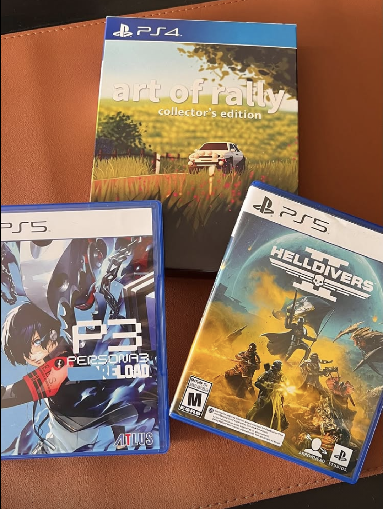
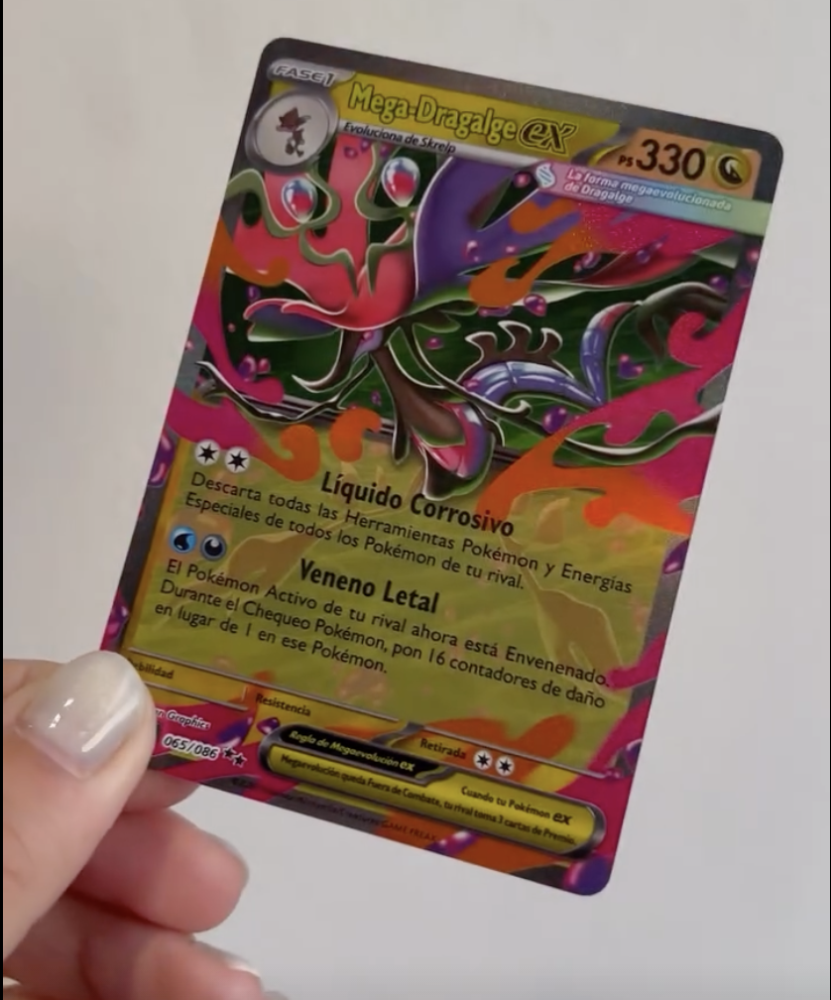
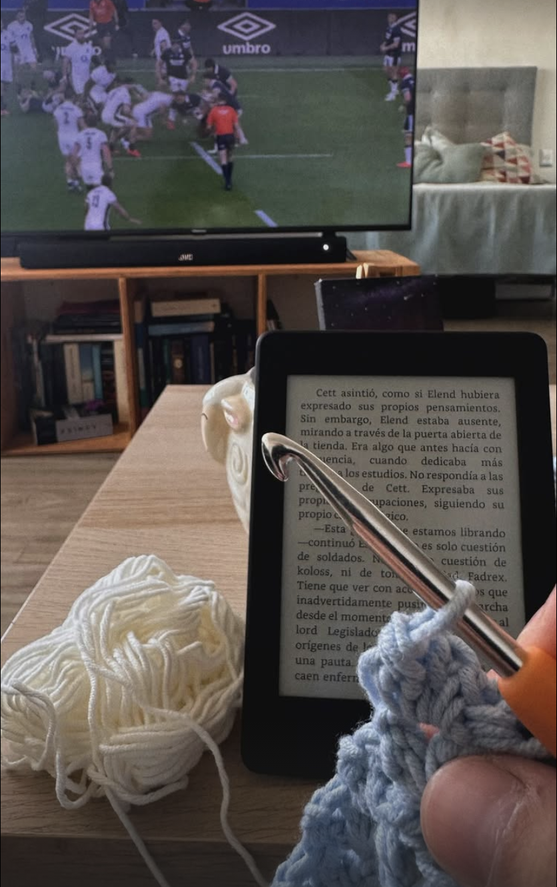

Hoy Sony anunció que [sus juegos ya no tendrán formato físico](https://blog.playstation.com/2026/07/01/physical-disc-production-ending-in-january-2028-for-new-games-releasing-on-playstation-consoles/). A partir de enero de 2028, ok, pero el sabor de boca horrible no me lo saca nadie. 

Me entró una pena casi irracional. Tengo más que claro que la industria de los videojuegos estaba siendo un asco hace bastante tiempo, pero hasta ahora casi que podía hacerme el loco porque no me afectaba. Soy un idiota porque recién me pongo a llorar cuando me afecta directamente, lo sé, pero así es como tengo que ser para no volverme completamente loco.

La pena fue casi por nostalgia, pero también pena real. Recuerdo claramente haber recibido juegos como regalos. Cuando chico, en navidad, de mi (ahora) esposa cuando empezamos a salir, ella también comprándose su primer juego y esperando ansiosa que llegara. Hoy... pos a llorar; ya no se va a poder (a menos que quieras hacer la atrocidad de regalar un papel con el código o con un "vale por un juego").

También fue como casi la gota que rebalsó el vaso. Consolas que pasan los 1000 dólares, otras que a pesar de haber salido hace 5 años no paran de subir de precio, juegos que no vienen completos a menos que pagues la edición coleccionista, despidos masivos, cierres de estudios icónicos, estudios que te cierran los servidores y te jodes, hiperfijación por el crecimiento exponencial que ha llevado a un empuje demasiado agresivo a los juegos como servicio, monetizaciones absurdas... 

Hoy me siento cansadísimo de esto. Estoy jugando al *Final Fantasy XVI*, y hoy no tengo ganas de terminarlo.

Pero tampoco quiero mis otros hobbies, porque también estoy cansado de ellos.

¿Las películas/series? Cansadísimo de que todas las semanas salgan 29384729834 cosas nuevas por Netflix/Prime/HBO/Hulu/Disney/Youtube/Apple TV/Paramount y que apenas se diferencien las unas a las otras porque todos hacerse virales y atacar casi los mismos nichos. Ah y, ¿si te enganchas con alguna? Junta miedo porque es un 50/50 de que la cancelen o renueven.

¿Tejer? Mira honestamente no es tan terrible como los otros, pero estoy bien cansado de buscar patrones y que la mitad sean falsos porque están hechos con IA. También me revienta las bolas que cada vez que alguien se entera de que tejo me diga "Ay deberías venderlos, yo te compraría".

¿Desarrollar una app? ¿Un juego? Los que están en la industria saben los 9128732983498 cambios que hay por semana y lo díficilísimo que se está haciendo no quemarse. Aparte hoy por hoy la obsesión (y el desafío) está en como marketear lo que estás haciendo, no en construirlo, *ynograciasnoquieroaprendereso*.

¿La música? Similar al crochet; ¿por qué no haces canciones? ¿por qué no te subes a RRSS? ¿por qué no subes temas a Spotify? Ni escuchar música nueva es tan placentero cuando tengo tan claro que detrás hay un artista que probablemente no le de la plata ni para grabar sus canciones.

Y es que las cosas a las que estoy recién entrando, entro con muchísima cautela, incluso  cosas que apenas alcanzan pa' ser hobbie. ¿Un álbum? Por alguna razón hoy todos quieren completarlo hoy mismo, ayer incluso si es posible. ¿Cartas? Ay, ese mercado de los revendedores es una maravilla eh. ¿Libros? Casi que se forma una competencia online por ver quién lee más.

Hasta el deporte, en el que literalmente no tengo que hacer nada, hoy está plagado de apuestas y toneladas de plata que hacen que todo se mueva de maneras tan extrañas y casi antinaturales...

Y sé que no tengo que participar activamente de todo esto. Puedo jugar juegos retro, puedo leer sin competir, puedo ver fútbol y tenis sin apostar, puedo desarrollar sin IA, puedo comprarme un vinilo y apoyar a los músicos. 

Pero hoy estoy cansado, negativo y no veo salida a nada de esto. Hipercomercialización, hiperfijación al crecimiento, monetizar todo, viralizar todo, que todo sea un negocio, que todo sea un servicio, que todo sea recurrente.

Todos mis hobbies hoy valen callampa, gracias.