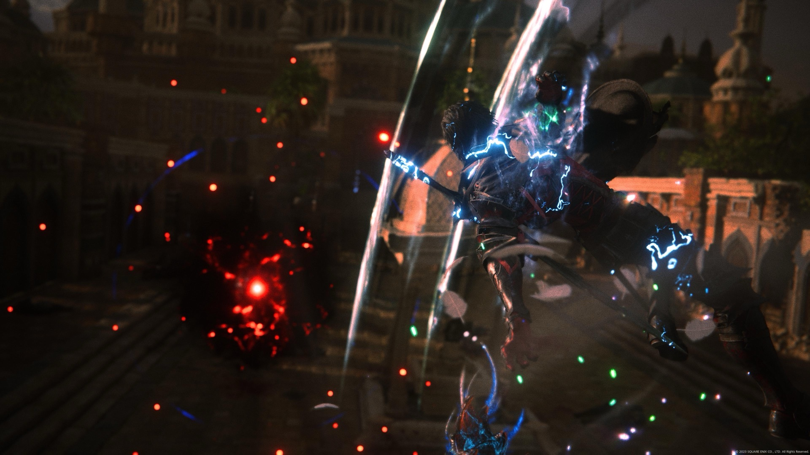
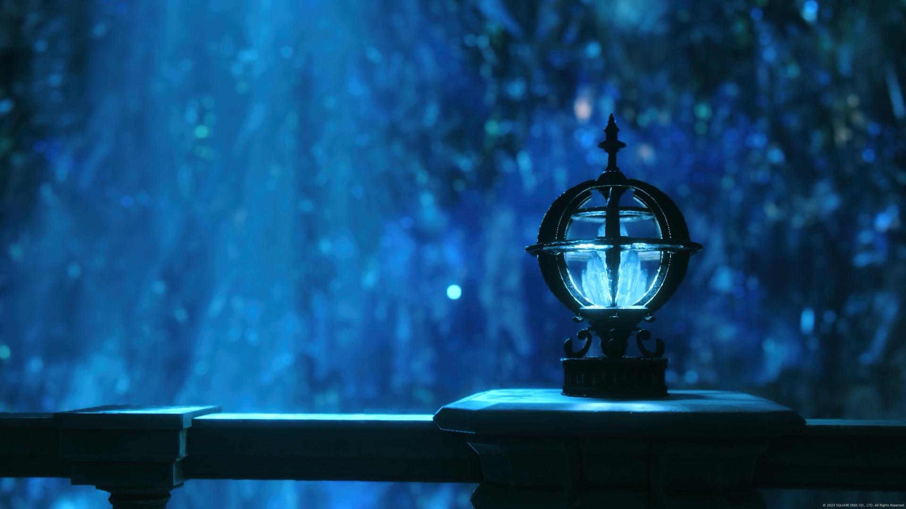
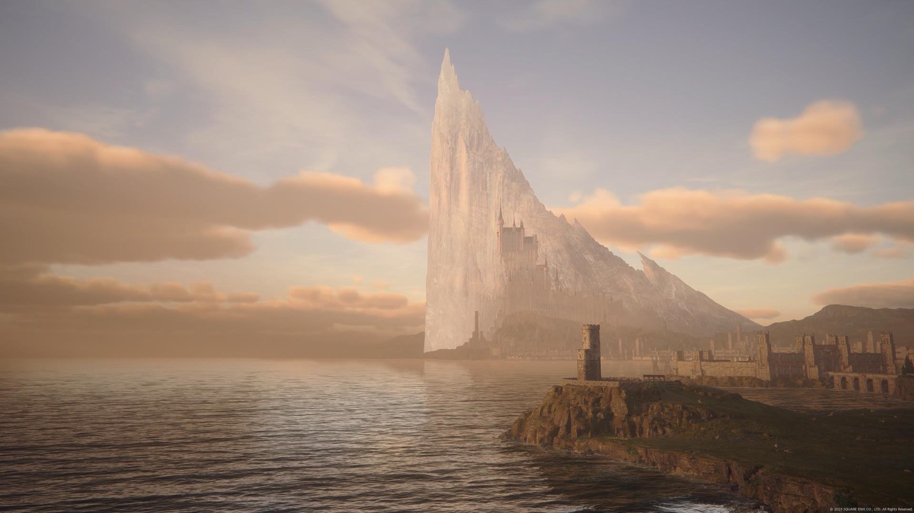
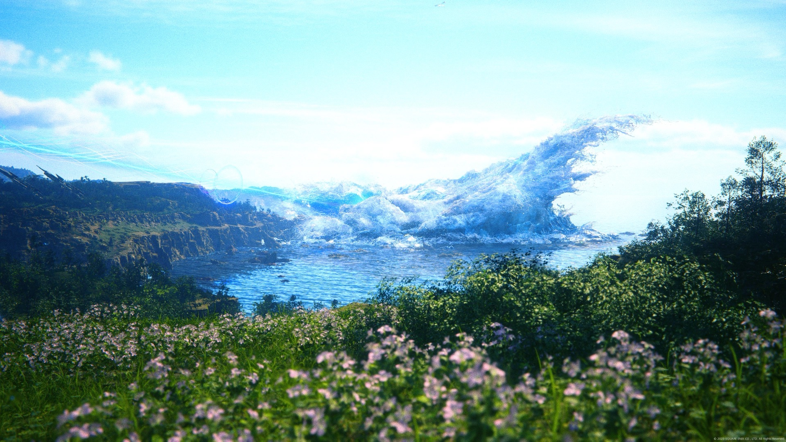

Érase una vez un yo hace 2 años sin haber jugado ningún Final Fantasy… fast-forward a hoy y ya tengo 5 sobre el cuerpo, 3 más comprados y a la Moi completamente convencida de empezar a jugar juntos al XIV.

Como pueden ver, es una saga a la que le estoy agarrando muchísimo cariño, muy rápido, y tal vez eso explique lo que me pasó con la última entrega de la saga principal. Porque FFXVI, como juego, es un… 4(?), pero tiene un alma, un cariño, una historia y unos personajes que me hicieron olvidar todo lo que el juego estaba haciendo que se podría catalogar como un "mal diseño".

## Estructura terrible

La historia de Clive parte de forma absolutamente increíble. De hecho, antes del lanzamiento, soltaron una demo con el prólogo del juego, que si hacen memoria, volvió loco a absolutamente todo el mundo. No obstante, sí que pecaba de ser lineal, pero al ser el prólogo, dejaba a todo el mundo con la esperanza de un nuevo clasicazo en la saga cuando el mundo se abriera.

El tema es que realmente el mundo jamás se abre tanto. Sí, se abre un poquito, pero son escenarios semilineales igual, y tampoco son muy grandes, ni son muchos.

Aquí esta el primer gran pecado, que para ser esa historia épica que influye sobre todo el mundo, ese mundo se siente pequeño y sin mucha vida. Principalmente por el tamaño de los mapas y porque los escenarios que sí deberían ser grandes terminan restringidos a un pasillo aún más pasilloso que juegos pasilleros como The Last of Us.

El segundo gran pecado es lo que lo terminó matando a ojos de los no fans de la saga, y son sus misiones secundarias de mierda MMO que no tienen ningún lugar en un juego de un jugador. Peeeeero… hablaré de esto más adelante, paciencia

## Lo regular

El combate es mega entretenido, muchas combinaciones posibles, infinitas luces, partículas, fluidez, crowd-control, etc etc etc. Y a medida que avanza el juego no hace más que mejorar las habilidades de Clive.

Pero es fácil. muydemasiado fácil. También debo encontrarle razón a la gente con que esta sección en particular del juego se siente súper poco Final Fantasy. Además, a pesar de que el juego tiene bastante customización, salvo los poderes que tienes disponibles, afecta poco y nada porque hay poca decisión. Solo hay mejor armamento y equipamiento, no hay tipo "esto me acomoda más a mi estilo de juego", solo hay "con esto pego más, voy".

En los DLC el tema del equipamiento se pone algo mejor, y también es un poco más difícil, pero duran tan poco que en verdad no terminan moviendo la balanza.

## Moriría por Valisthea

Ahora, volviendo al tema de las secundarias, que sí bien son horribles y te hacen ir a buscar Ajo al fin del mundo después de que básicamente peleaste en el espacio exterior contra DIOS, las quiero mucho e hice el 100% de ellas (cosa que no hago prácticamente nunca).

Todo esto se debe a 3 cosas: la historia, el lore y los personajes

La historia es edgy y se le nota demasiado que quisieron copiar los feels de Game of Thrones, pero tiene un SENTIMIENTO que cuesta encontrar en AAA (y ojo que con lo que costó este juego es prácticamente un AAAA si quieren). Tiene cuestionamientos filosóficos bien interesantes, un montón de capas que se van mostrando de a poco y hacen que todo calce en su lugar.

El lore es coherente y abundante, y le da una base espectacular a la historia. El mundo, con lo chico que se ve por culpa de los escenarios, se siente que tiene miles de años de historia, y te incita a preguntarte qué cresta significa cada cosa que encuentras, y siempre te da una respuesta coherente.

Los personajes, si bien suelen girar y depender demasiado de Clive, todos tienen su personalidad y su trasfondo súper bien armados. Y MORIRÍA POR TODOS. Se arma un grupo de gente increíble, cada uno con sus roles marcados que acompañan al protagonista hasta el final, que no son más que la guinda de la torta que es la presentación de este juego

Y finalmente… es que VISTE ESA DIRECCIÓN DE ARTE HERMANO MÍO. Que belleza de mundo que es Valisthea.

## Ya sé que es lo que busco en estas experiencias

Le agradezco harto a este juego, porque me hizo darme cuenta un poquito más de qué es lo que aprecio en los juegos.

Porque soy capaz de aguantar un combate disfrutón, niveles simplones, estructura mediocre, misiones malas y personajes edgys… si es que me presentas un mundo profundo, coherente e interesante, o una historia con cuestionamientos dignos de plantearse.

Y es que esto se suma un poco a lo que yo ya sabía de mí; me da igual que un juego me entretenga.

Lo que me importa realmente es que sea una experiencia que me enriquezca y me haga sentirme inmerso en ella, sea cual sea los métodos que use para lograrlo.

