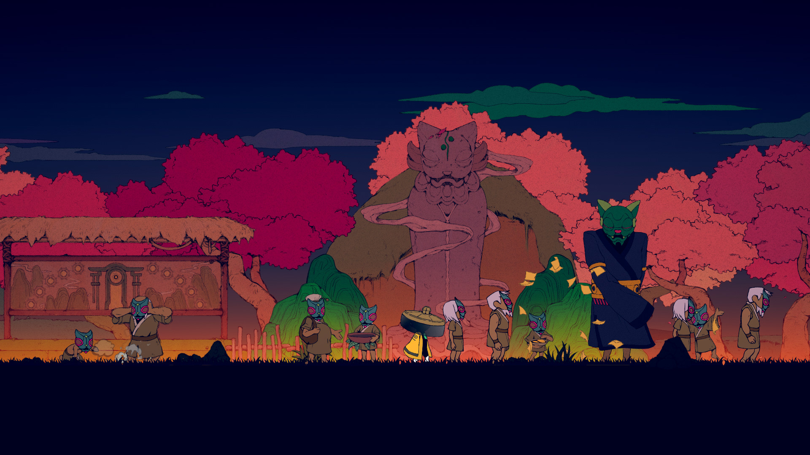
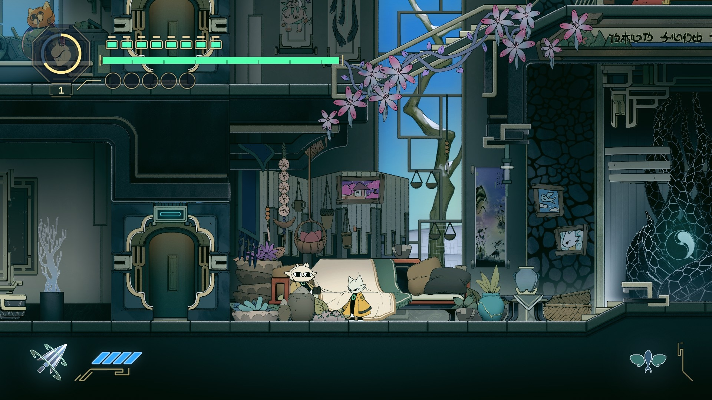
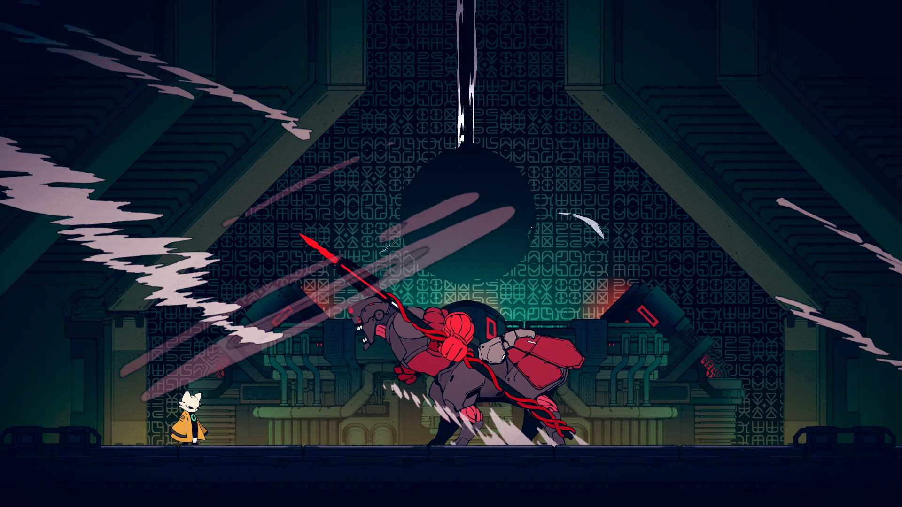

Voy a escribir un poco porque sí. No es que necesariamente sienta que este juego es digno de estudiar, pero creo que está bueno analizarlo desde mi punto de vista demasiado crítico, considerando que es un juego que me gustó muchísimo a pesar de tener varias cosas que usualmente me parecen "mal diseño". 

Para partir: como dije, Nine Sols me gustó. Si solo quieres la recomendación, esa es; es un gran juego, un metroidvania sólido, con una historia buenísima y un combate que no tiene nada que envidiarle al GOAT Sekiro. 

A partir de aquí me pongo odioso y pretencioso.

### La experiencia 

Justamente me agarraré de ahí para empezar, la experiencia Nine Sols es *muh wena*. Un combate medido al milímetro, controles súper responsivos, arte detalladísimo, historia buenísima y una duración exacta. Como si fuese poco, hay lore bien interesante; un mundo que, si bien es medio desierto, se siente como si fuese su propio lugar real. 

De hecho, la primera vez que intenté jugarlo me alejó justamente que no me esperaba tanto énfasis en la historia y mundo. Por lo que sabía del combate, pensé que iba a toparme con un mundo mucho más vacío, sin tanta explicación, y que el juego se iba a enfocar más en solo combatir y derrotar jefes, pero no. Me topé con un muy buen equilibrio entre historia y combate, en donde ambos aspectos están bastante bien desarrollados.

La historia y lore también tiene tintes filosóficos / políticos interesantes que no solo se quedan en una mención; Yi, el protagonista, es notoriamente anti-ricos, la historia también está basada en un montón de leyendas chinas reinterpretadas y se explora a bastante profundidad el taoísmo.

### Profundidad narrativa 

> Tú crees que la ciencia es la respuesta. Otros creen que la inacción es la verdad

Sobre esto último me parece que es donde el juego más hace énfasis; el taoísmo. Personalmente no tenía idea de esto, pero me parece súper interesante como la historia del juego refleja muchísimo esa discusión entre interferir en el curso de las cosas vs no interferir. Básicamente, todo el mundo del juego y la historia tienen lugar por culpa de esta pregunta… a pesar de que las mecánicas no me dicen mucho de esto.

Tal vez las conversaciones con Shuanshuan y el resto de personajes en el pabellón pueden hablar sobre hacer algo vs dejarlo estar pero, mecánicamente, el juego siempre te pide interferir, hacer algo. No hay espacio para que el jugador decida en qué parte del espectro de la pregunta caes y eso me parece una oportunidad desaprovechada. 

Pero, aunque esta temática no se aplique tanto a las mecánicas y el gameplay, me gusta mucho que todo el conflicto narrativo (que da el puntapié inicial a todo el juego) nazca de esta pregunta; ¿interferir o dejar que las cosas sigan su curso natural?

### Si si, que hay disonancia ludonarrativa como siempre… peeeeero 

El otro lado del juego es un poco… zen (?) 
> Nunca he aprendido a hacer las cosas por intuición

> ¿Crees que por eso las cosas han sido difíciles para tí?

> ¿Qué quieres decir?

> Tal vez la mayoría de las cosas no sean tan complicadas. Solo tienes que dar lo mejor de tí

Esta frase me resume a la perfección el combate. O al menos hasta que aprendes los patrones de los enemigos y empiezas a hacer las cosas un poco más de memoria (aunque siga siendo casi intuitivo). Después pasa a ser un poco 

> Tengo miedo. Pero también aprendí a aceptar el fracaso

Y es que cuando te viene ese jefe final y te mete 5 ataques en 2 segundos que sabes que puedes parrear pero te da un poquito de miedo hacerlo mal… tal como pasa en todo este género de peleas prueba y error, lo mejor que puedes hacer es aceptar que vas a fallar, porque con esos fracasos, eventualmente lo vas a lograr. Y eso es lo más bonito de estos juegos que tanto me gusta jugar.

### Otro tipo de juego que amo 

Tal como me pasó con [Final Fantasy XVI](/blog/04-final-fantasy-xvi), hay hartas cosas que no me deberían cuadrar tanto en Nine Sols (menos que en FF, eso si), pero que termino pasando por encima porque el juego hace otras cosas extremadamente bien. 

Y es que, como dije ahí, si me das un mundo consistente, con buen lore y que encima está construido sobre un concepto que tocas a mucha profundidad en la historia, junto con un metroidvania sólido con un combate espectacular, pos me tienes ganado aunque no hagas esas cosas pretenciosas que me gustan a mi. 

Pido poco ah 
